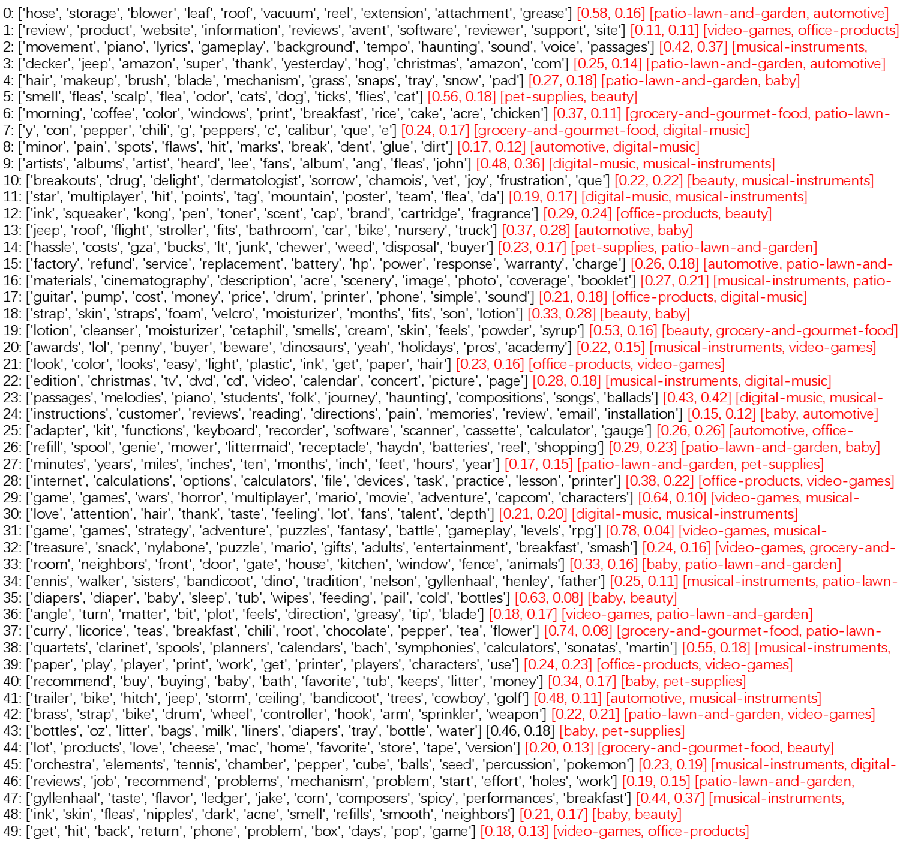
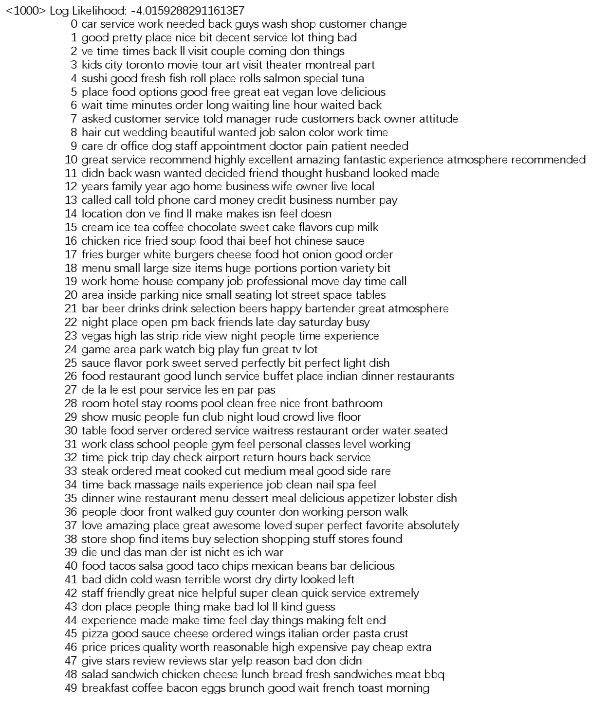
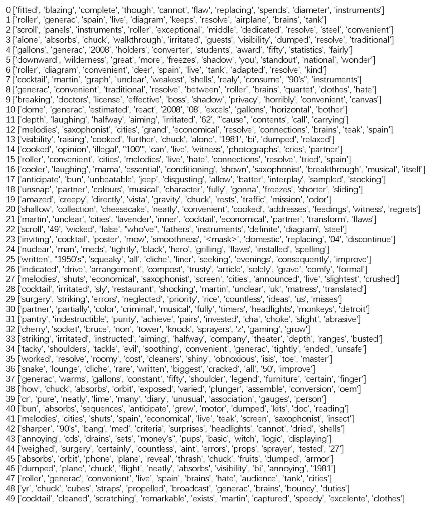

# CCL2023

网站中提供的是在CCL2023中提交的论文“基于自监督学习的方面聚类”的源代码与数据集等相关文件。

# 数据集说明

amazon-aspects-category-distribution.txt：方面的类别分布文档

amazon-review-100k.rar：Amazon数据集文档

amazon-embed.txt：Amazon数据集词嵌入文档

# 模型训练步骤说明

请根据以下步骤实现模型的训练：

(1) 解压 amazon-review-100k.rar 文件；

(2) 运行 hrea_amazon_datapreprocess.py 以实现数据集预处理；

(3) 运行 hrea_amazon_encoder_train.py 以训练文本自编码器；

(4) 运行 hrea_amazon_encoder_visual.ipynb 以实现评论聚类的可视化；

(5) 运行 hrea_amazon_level1_train.py 以训练学生模型（第二个自编码器）；

(6) 运行 hrea_amazon_level1_explore.py 以实现方面聚类。

# 使用t-SNE可视化的实验效果图

这张图片展示了对Amazon数据集可视化效果，每种颜色代表一个类别。

# ACTAAE实现对Amazon数据集进行50个方面簇聚类

# 方面聚类基线模型实验结果图
（1）LDA

（2）K-means

（3）GMM

