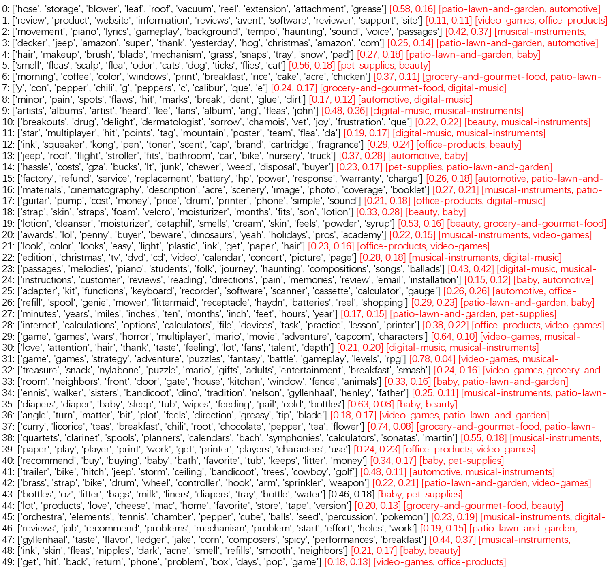
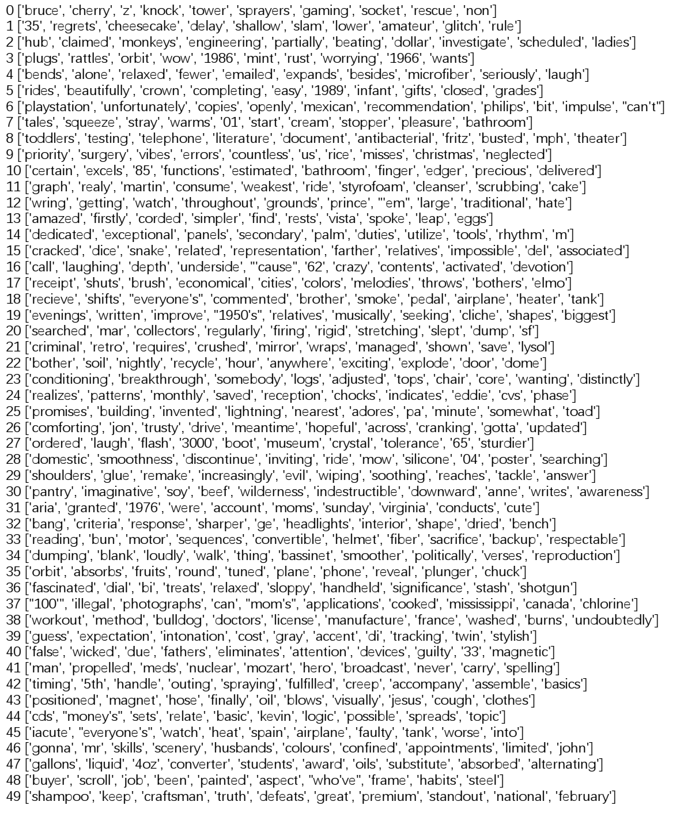
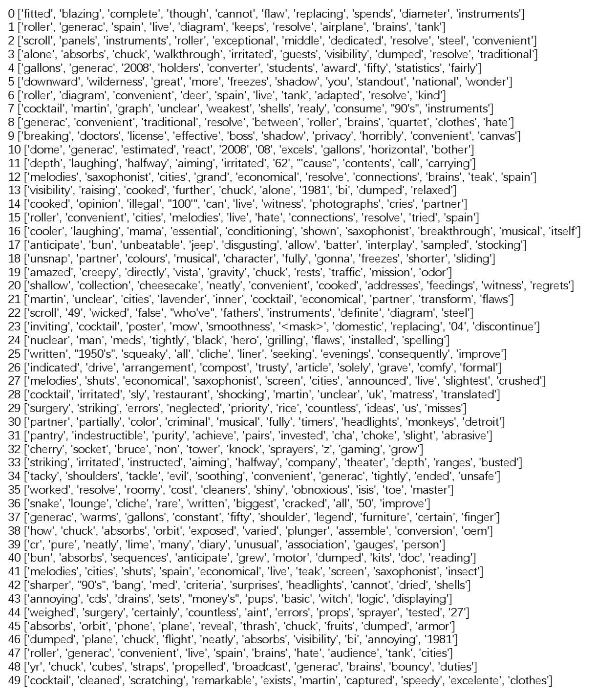

# CCL2023

网站中提供的是在CCL2023中提交的论文“基于自监督学习的方面聚类”的源代码与数据集等相关文件。

# 数据集说明

amazon-aspects-category-distribution.txt：方面的类别分布文档

amazon-review-100k.rar：Amazon数据集文档

amazon-embed.txt：Amazon数据集词嵌入文档

# 模型训练步骤说明

请根据以下步骤实现模型的训练：

(1) unzip the file amazon-review-100k.rar

(2) run the file hrea_amazon_datapreprocess.py to process dataset.

(3) run the file hrea_amazon_encoder_train.py to train a text autoencoder.

(4) run the file hrea_amazon_encoder_visual.ipynb to see the visulized reviews

(5) run the file hrea_amazon_level1_train.py to train the first student model

(6) run the file hrea_amazon_level1_explore.py to explore the aspect-groups in first level

# 使用t-SNE可视化的实验效果图

这张图片展示了对Amazon数据集中的评论自编码后聚类可视化，每种颜色代表一个类别。

# ACTAAE实现对Amazon数据集进行50个方面簇聚类

# 方面聚类基线模型实验结果图
（1）LDA

（2）K-means

（3）GMM

